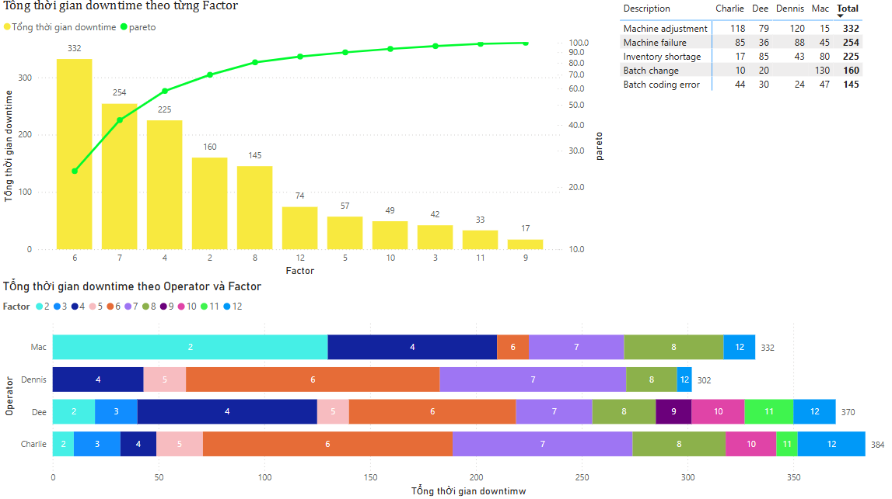

# 🛠️ Downtime Analysis Report

## 📌 Overview
This Power BI project visualizes equipment downtime data. The goal is to understand causes of downtime and suggest improvements for operational efficiency.

## 📁 Files
- `downtime.pbix`: Power BI report file
- `Downtime.PNG`: Dashboard screenshot

## 📊 Tools Used
- Power BI
- Excel
- Power Query

## 🔧 Key Features
- KPIs: Total Downtime Hours, Downtime Frequency, Most Affected Machines
- Visuals: Downtime by Reason, Machine, and Shift
- Slicers: Time Period, Machine ID, Department

## 📷 Screenshot

## 📥 Download
Open the `.pbix` file in Power BI Desktop to view the full report.

## 🧠 Key Insights
- Mechanical issues account for the majority of total downtime.
- Machine #103 and #206 had the most incidents in the past quarter.
- Night shifts experienced higher downtime frequency.
